# Sample Monorepo

## Table of Contents

- [Architecture Overview](#architecture-overview)
- [Prerequisites](#prerequisites)
- [Walkthrough 1: IaC provisioning for the Platform (with Github Action)](#walkthrough-1-iac-provisioning-for-the-platform-with-github-action)
- [Walkthrough 2: Release New Version Application (with Github Action)](#walkthrough-2-release-new-version-application-with-github-action)
- [Walkthrough 3: Monitoring (SLI/SLO and Distributed Tracing) (Local Setup required)](#walkthrough-3-monitoring-slislo-and-distributed-tracing-local-setup-required)

---

## Architecture Overview

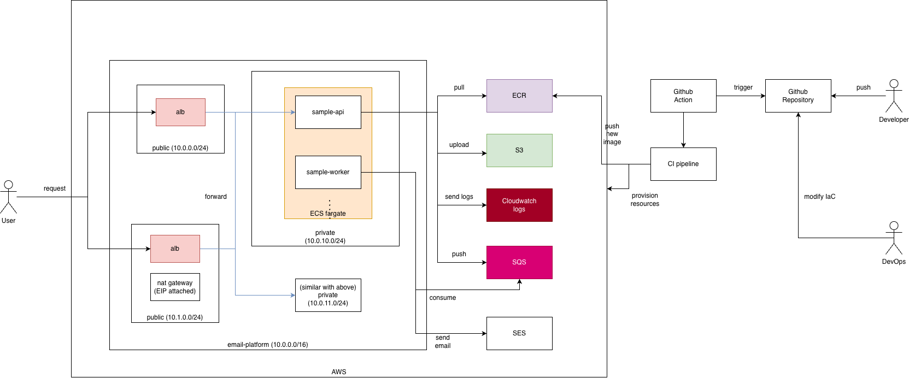

### Project Structure

```
sample-monorepo/
├── cmd/                          # Service entrypoints
│   ├── sampleapi/                # HTTP API service
│   │   ├── main.go
│   │   └── Dockerfile
│   └── sampleworker/             # Background worker service
│       ├── main.go
│       └── Dockerfile
├── internal/                     # Shared libraries
│   ├── tracing/                  # OpenTelemetry tracing
│   └── utils/                    # Logging utilities
├── task-definitions/             # ECS task definitions (Jsonnet)
│   ├── lib/base.libsonnet        # Shared task definition library
│   ├── sampleapi.jsonnet
│   └── sampleworker.jsonnet
├── terraform/aws/                # Infrastructure as Code
│   ├── modules/                  # Reusable Terraform modules
│   │   ├── ecs-fargate-service/  # ECS Fargate service module
│   │   │   ├── main.tf
│   │   │   ├── variables.tf
│   │   │   └── outputs.tf
│   │   └── sqs-queue/            # SQS queue module
│   │       ├── main.tf
│   │       ├── variables.tf
│   │       └── outputs.tf
│   ├── environments/             # Environment-specific configs
│   │   ├── dev.tfvars
│   │   ├── staging.tfvars
│   │   └── prod.tfvars
│   ├── main.tf                   # Provider configuration
│   ├── backend.tf                # Remote state backend
│   ├── variables.tf               # Variable definitions
│   ├── data.tf                   # Data sources
│   ├── vpc.tf                    # VPC, subnets, NAT gateway
│   ├── sg.tf                     # Security groups
│   ├── alb.tf                    # Application Load Balancer
│   ├── ecs.tf                    # ECS Cluster, IAM roles
│   ├── shared-infrastructure.tf  # SQS, Secrets Manager, SES
│   ├── service-sampleapi.tf      # API service definition
│   ├── service-sampleworker.tf    # Worker service definition
│   ├── outputs.tf                # Output values
│   └── terraform.tfvars          # Default variables
├── monitoring/                   # Observability stack
│   ├── prometheus/               # Metrics collection
│   │   ├── prometheus.yml        # Prometheus configuration
│   │   └── alerts.yml            # Alert rules
│   ├── grafana/                  # Dashboards & visualization
│   │   ├── dashboards/           # Dashboard definitions
│   │   │   ├── services-overview.json
│   │   │   └── slo-dashboard.json
│   │   └── provisioning/         # Auto-provisioning configs
│   │       ├── dashboards/
│   │       └── datasources/
│   └── promtail/                 # Log aggregation
│       └── promtail-config.yml  # Promtail configuration
├── .github/workflows/            # CI/CD pipelines
│   ├── ci.yml                    # Build & test on PRs
│   ├── terraform.yml             # Infrastructure deployment
│   ├── release-sampleapi.yml     # API service release
│   └── release-sampleworker.yml  # Worker service release
└── docker-compose.local.yml      # Local development stack
```

---

## Prerequisites

- Go 1.23+
- Docker & Docker Compose
- Terraform 1.13+
- jsonnet CLI (`brew install jsonnet` or `apt-get install jsonnet`)
- AWS CLI v2
- Github Action
- LocalStack (Pro license required for plan and apply ECS features in CI/CD)

### **Important points**:
- The implementation is not running on a real cloud services, so there will be some **limitation**:
  - Using localstack to demo and validate `terraform plan` only, the applied part already done in local, so the github action PR only support showing diff from `plan`, `terraform apply` steps only a mock behaviors
  - Application release requiring applying new task-definitions to ECS services which running in localstack, to update a new task on ECS in localstack via github action, `Docker in Docker` currently not supporting, so applying task definition is only mocking ref
  - For the best practice, ECS Fargate logging and monitoring should follow up with Cloudwatch logs and combining tracing by using Datadog, but these approaches requiring additional costs, so the idea to specify SLO metrics by setting up a separate monitoring system locally.
  - Monitoring stacks requiring spin up from mounted volume services stack (with loki, prometheus and jaeger), localstack has some limitation and requiring complex setup, so this part will be set up and run locally

---

## Walkthrough 1: IaC provisioning for the Platform (with Github Action)

### User Story

> *"As a Backend Engineer, I only need to provide my code and define basic infrastructure configuration (CPU, memory, replicas, autoscaling rules, ALB paths). The Devops Team should handle the rest."*

> *"As a Backend Engineer, I want CI/CD to automatically provision/update infrastructure when I change configurations."*

### What

#### Infrastructure Overview

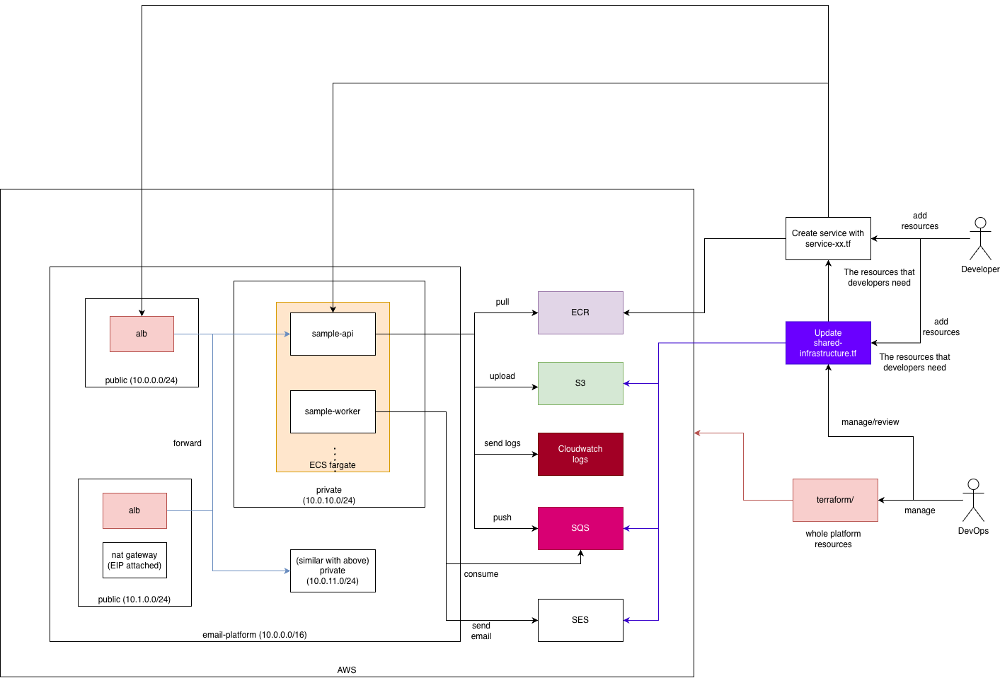

### Terraform Modules

| Module | Description | Used In | Key Features |
|--------|-------------|---------|--------------|
| `ecs-fargate-service` | ECS Fargate service | `service-*.tf` (Backend Engineer) | ALB integration, auto-scaling, CloudWatch logs, health checks |
| `sqs-queue` | SQS queue with DLQ | `shared-infrastructure.tf` (Devops Team) | Dead letter queue, IAM policies for publishers/consumers |

### Infrastructure Files Overview

| File | Purpose | Responsible Owner |
|------|---------|-------------------|
| `main.tf` | Provider configuration, Terraform settings | Devops Team |
| `backend.tf` | Remote state backend configuration (S3/DynamoDB) | Devops Team |
| `variables.tf` | Variable definitions | Devops Team |
| `data.tf` | Data sources (availability zones, etc.) | Devops Team |
| `vpc.tf` | VPC, subnets, NAT gateway | Devops Team |
| `sg.tf` | Security groups (ALB, ECS) | Devops Team |
| `alb.tf` | Application Load Balancer | Devops Team |
| `ecs.tf` | ECS Cluster, IAM roles | Devops Team |
| `shared-infrastructure.tf` | SQS queues, Secrets Manager | Devops Team |
| `outputs.tf` | Output values (VPC IDs, ALB DNS, etc.) | Devops Team |
| `service-sampleapi.tf` | API service definition | Backend Engineer |
| `service-sampleworker.tf` | Worker service definition | Backend Engineer |
| `environments/*.tfvars` | Environment-specific variable overrides | Devops Team |


- DevOps Team will prepare and responsible for all the Platform
- Backend Engineer only need to focus on basic infrastructure configuration

### Workspaces

Infrastructure uses Terraform workspaces to manage environments:

```bash
# List available workspaces
terraform workspace list

# Switch to staging
terraform workspace select staging

# Switch to production
terraform workspace select prod
```


The infrastructure is organized into two categories:

```
terraform/aws/
├── shared-infrastructure.tf    # DevOps team manages (SQS, Secrets, SES)
├── service-sampleapi.tf        # Developer defines (per-service)
├── service-sampleworker.tf     # Developer defines (per-service)
├── main.tf                     # Provider configuration
├── backend.tf                   # Remote state backend
├── variables.tf                 # Variable definitions
├── data.tf                      # Data sources
├── vpc.tf                       # VPC, subnets, NAT gateway
├── sg.tf                        # Security groups
├── alb.tf                       # Application Load Balancer
├── ecs.tf                       # ECS Cluster, IAM roles
├── outputs.tf                   # Output values
└── modules/
    ├── ecs-fargate-service/    # Reusable service module
    └── sqs-queue/              # Reusable queue module
```

| Category | Owner | Examples | File |
|----------|-------|----------|------|
| **Shared Infrastructure** | Devops Team | SQS queues, Secrets Manager, SES | `shared-infrastructure.tf` |
| **Service Infrastructure** | Backend Engineers | ECS services, auto-scaling, ALB rules | `service-sampleapi.tf`, `service-sampleworker.tf` |

#### Shared Infrastructure (`shared-infrastructure.tf`)

Resources shared across all services are managed centrally by the devops team but allow backend engineer to provision:

```hcl
# terraform/aws/shared-infrastructure.tf

# ===========================================
# SQS Queue for Tasks (shared by api → worker)
# ===========================================
module "tasks_queue" {
  source = "./modules/sqs-queue"

  name         = "tasks"
  project_name = var.project_name
  environment  = var.environment

  # Queue configuration
  visibility_timeout_seconds = 300     # 5 minutes
  message_retention_seconds  = 1209600 # 14 days
  receive_wait_time_seconds  = 20      # Long polling

  # Dead Letter Queue for failed messages
  enable_dlq        = true
  max_receive_count = 3  # Max 3 attempts before moving to DLQ

  # IAM: Grant permissions to ECS task roles
  publisher_role_names = [aws_iam_role.ecs_task_role.name]  # sampleapi can publish
  consumer_role_names  = [aws_iam_role.ecs_task_role.name]  # sampleworker can consume
}

# ===========================================
# Secrets Manager (for sensitive configuration)
# ===========================================
resource "aws_secretsmanager_secret" "worker_secret" {
  name        = "${var.project_name}/${var.environment}/worker-secret"
  description = "Secret key for sampleworker service"
}
```

**Why Shared Infrastructure?**
- **SQS Queues**: Multiple services may publish/consume from the same queue
- **Secrets Manager**: Centralized secret management with rotation support
- **SES**: Email sending service shared across worker services

### Developers provision resources to their own service

#### Step 1: Developer Creates Service Configuration

To add a new service, developers create a Terraform file that uses the `ecs-fargate-service` module:

```hcl
# terraform/aws/service-myservice.tf

locals {
  myservice_config = {
    staging = {
      cpu            = 256
      memory         = 512
      desired_count  = 1
      min_count      = 1
      max_count      = 2
    }
    prod = {
      cpu            = 512
      memory         = 1024
      desired_count  = 2
      min_count      = 2
      max_count      = 10
    }
  }
  myservice = lookup(local.myservice_config, var.environment, local.myservice_config["staging"])
}

module "myservice" {
  source = "./modules/ecs-fargate-service"

  name         = "myservice"
  project_name = var.project_name
  environment  = var.environment
  
  # Resource configuration
  cpu           = local.myservice.cpu
  memory        = local.myservice.memory
  desired_count = local.myservice.desired_count
  
  # Auto Scaling
  enable_autoscaling = true
  min_count          = local.myservice.min_count
  max_count          = local.myservice.max_count
  
  # Load Balancer (optional)
  enable_load_balancer = true
  lb_path_patterns     = ["/api/myservice/*"]
  lb_health_check_path = "/health"
  
  # ... other required fields
}
```

#### Step 2: Developer Creates Task Definition (Jsonnet)

```jsonnet
// task-definitions/myservice.jsonnet
local base = import 'lib/base.libsonnet';

local container = base.container('myservice', '%s:%s' % [ecrRepository, imageTag], {
  port: 8080,
  environment: [
    base.envVar('LOG_LEVEL', envConfig.logLevel),
    base.envVar('ENVIRONMENT', environment),
  ],
  healthCheck: base.healthCheck('wget -q --spider http://localhost:8080/health || exit 1'),
});

base.taskDefinition('myservice', [container], { cpu: 256, memory: 512 })
```

#### Step 3: CI/CD Provisions Infrastructure

```
PR Created → terraform.yml triggered
    │
    ├── terraform plan (staging) → Comment on PR with diff
    ├── terraform plan (prod)    → Comment on PR with diff
    │
PR Merged → Manual workflow_dispatch
    │
    ├── Apply staging (auto)
    └── Apply prod (requires approval)
```

### Automated IaC with CI/CD Pipeline: `terraform.yml`

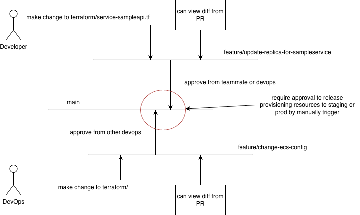

| Trigger | Action | Environment |
|---------|--------|-------------|
| PR to `main` | `terraform plan` | staging + prod (parallel) |
| `workflow_dispatch` | `terraform apply` | staging (auto) or prod (approval required) |

**Workflow Diagram:**

```
┌───────────────┐     ┌───────────────┐     ┌───────────────┐
│    PR Open    │────▶│    Plan PR    │────▶│  Comment on   │
│               │     │   (matrix)    │     │      PR       │
└───────────────┘     └───────────────┘     └───────────────┘

┌───────────────┐     ┌───────────────┐     ┌───────────────┐
│   workflow    │────▶│     Apply     │────▶│     Apply     │
│   dispatch    │     │    Staging    │     │     Prod      │
└───────────────┘     └───────────────┘     └───────────────┘
                                                    │
                                            (approval required)
```

### Pull Request Example:
- Create a new service PR: https://github.com/tnqv/sample-monorepo/pull/11
  - `terraform plan` results output on comment: 
    - staging: https://github.com/tnqv/sample-monorepo/pull/11#issuecomment-3638338510
    - prod: https://github.com/tnqv/sample-monorepo/pull/11#issuecomment-3638338361

---

## Walkthrough 2: Release New Version Application (with Github Action)

### User Story

> *"As a Backend Engineer, when I merge code to the release branch, CI/CD should automatically deploy my application to staging, and after approval, to production."*

General idea flow:

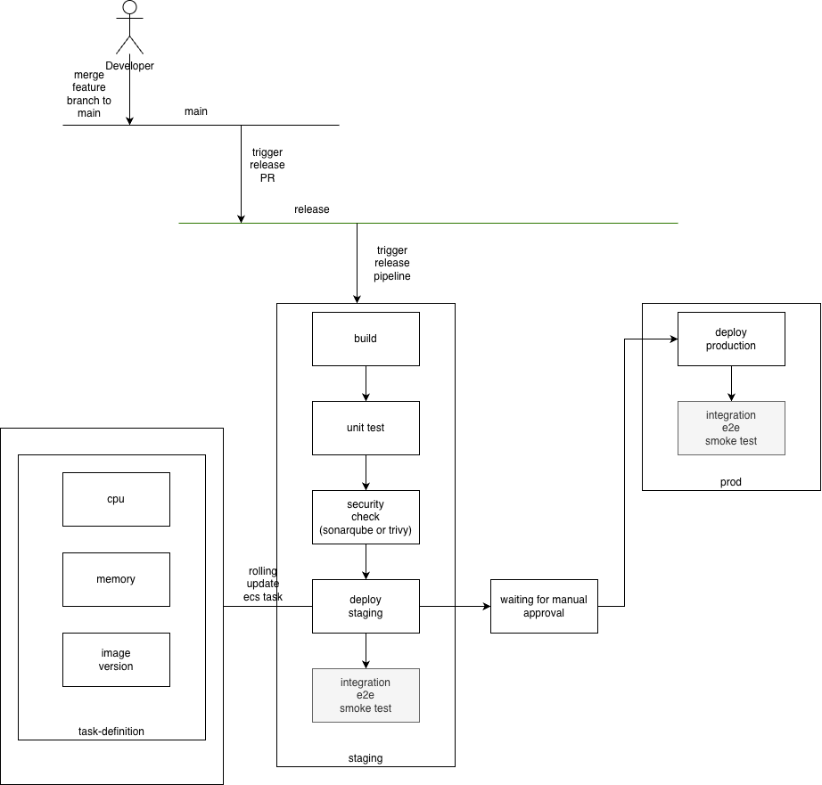

### CI/CD Pipelines

| Workflow | Service | Trigger |
|----------|---------|---------|
| `release-sampleapi.yml` | sampleapi | Push to `release` + paths `cmd/sampleapi/**` |
| `release-sampleworker.yml` | sampleworker | Push to `release` + paths `cmd/sampleworker/**` |

### How It Works

#### Step 1: Backend Developers Open a new PR (with feature branch)

Code changes to `cmd/sampleapi/**` or `task-definitions/sampleapi.jsonnet` trigger CI checks:

```
Developer creates feature branch & opens PR
    │
    ▼
┌───────────────────────────────────────────────────────┐
│                 CI Pipeline (ci.yml)                  │
├───────────────────────────────────────────────────────┤
│                                                       │
│   ┌─────────────┐  ┌─────────────┐  ┌─────────────┐   │
│   │    Lint     │  │  Unit Test  │  │    Build    │   │
│   │ (golangci)  │  │  (go test)  │  │    Check    │   │
│   └──────┬──────┘  └──────┬──────┘  └──────┬──────┘   │
│          │                │                │          │
│          └────────────────┼────────────────┘          │
│                           │                           │
│                           ▼                           │
│                    ┌─────────────┐                    │
│                    │  All Pass?  │                    │
│                    └──────┬──────┘                    │
│                           │                           │
└───────────────────────────┼───────────────────────────┘
                            │
                            ▼
                     ┌─────────────┐
                     │  PR Ready   │  ← Code review & merge to `main`
                     │  to Merge   │
                     └─────────────┘
```

**CI Checks (`ci.yml`) include:**

| Job | Tool | Description |
|-----|------|-------------|
| **Lint** | `golangci-lint` | Go code style, best practices, static analysis |
| **Test** | `go test -race` | Unit tests with race detection + coverage |
| **Build** | Docker Buildx | Verify Docker images can be built |
...

#### Step 2: Merge to `main` and Release

After PR is approved and merged to `main`:

```
Merge PR to 'main' → Push 'main' to 'release' branch
    │
    ▼
┌───────────────────────────────────────────────────────┐
│            Release Pipeline (release-*.yml)           │
├───────────────────────────────────────────────────────┤
│                                                       │
│  ┌─────────────────────────────────────────────────┐  │
│  │              Build & Push Image                 │  │
│  ├─────────────────────────────────────────────────┤  │
│  │  1. Generate image tag (commit + timestamp)     │  │
│  │     └── sampleapi-abc123-20241211120000         │  │
│  │  2. Build Docker image from Dockerfile          │  │
│  │  3. Tag image for ECR                           │  │
│  │  4. Push to LocalStack ECR (mock)               │  │
│  └────────────────────┬────────────────────────────┘  │
│                       │                               │
│                       ▼                               │
│  ┌─────────────────────────────────────────────────┐  │
│  │              Deploy Staging (auto)              │  │
│  ├─────────────────────────────────────────────────┤  │
│  │  1. Render task definition (Jsonnet)            │  │
│  │  2. Register task definition                    │  │
│  │  3. Update ECS service (mock)                   │  │
│  └────────────────────┬────────────────────────────┘  │
│                       │                               │
│                       ▼                               │
│  ┌─────────────────────────────────────────────────┐  │
│  │           Approval Required (GitHub)            │  │
│  │           ← Manual approval needed              │  │
│  └────────────────────┬────────────────────────────┘  │
│                       │                               │
│                       ▼                               │
│  ┌─────────────────────────────────────────────────┐  │
│  │            Deploy Prod (after approval)         │  │
│  └─────────────────────────────────────────────────┘  │
│                                                       │
└───────────────────────────────────────────────────────┘
```

#### During `Deploy Staging`

##### Step 3: Task Definition Rendering

The release pipeline uses Jsonnet to render task definitions with environment-specific values:

```bash
jsonnet \
  --ext-str IMAGE_TAG="sampleapi-abc123-20241211" \
  --ext-str ENVIRONMENT="staging" \
  --ext-str ECR_REPOSITORY="..." \
  --ext-str EXECUTION_ROLE_ARN="..." \
  --ext-str TASK_ROLE_ARN="..." \
  --ext-str SQS_QUEUE_URL="..." \
  sampleapi.jsonnet > task-definition.json
```

##### Step 4: ECS Service Update

```bash
# Register new task definition
aws ecs register-task-definition --cli-input-json file://task-definition.json

# Update service with new task definition
aws ecs update-service \
  --cluster email-platform-staging \
  --service email-platform-staging-sampleapi \
  --task-definition <new-task-def-arn> \
  --force-new-deployment
```

*Note: this step is mocking with localstack, `update-service` requiring `Docker in Docker`, but currently it's not supporting in Github Action


### Release pipeline examples:

- Github Action Deployment overview: https://github.com/tnqv/sample-monorepo/actions/runs/20132058764
  - Step 1:
    - Add feature PR: https://github.com/tnqv/sample-monorepo/pull/15
  - Step 2:
    - Create a PR to release: https://github.com/tnqv/sample-monorepo/pull/16
    - Build and Push image to ECR: https://github.com/tnqv/sample-monorepo/actions/runs/20132058764/job/57775707372
  - Step 3 & 4: Deploy
    - Deploy to staging: https://github.com/tnqv/sample-monorepo/actions/runs/20132058764/job/57775926636
    - Deploy to production: https://github.com/tnqv/sample-monorepo/actions/runs/20132058764/job/57776082617

---

## Walkthrough 3: Monitoring (SLI/SLO and Distributed Tracing) (Local Setup required)

### User Story

> *"As a Product Developer, I need to know if my application is running and healthy."*

> *"As a Product Developer, I want to collect some abnormal metrics that affect the application's performance as quickly as possible.."*

> *"As a Product Developer, when something goes wrong, I want to trace the request flow across services to find the root cause."*

> *"As the Devops Team, I need to have bird's-eye view to the overall for the Platform"*

### How

This example demonstrates how to start the monitoring stack locally and view metrics in Grafana dashboards including SLO defined.

#### Step 1: Start the Monitoring Stack

Start all services including the monitoring stack:

```bash
docker-compose -f docker-compose.local.yml up -d
```

Wait for all services to be healthy (check with `docker ps`).

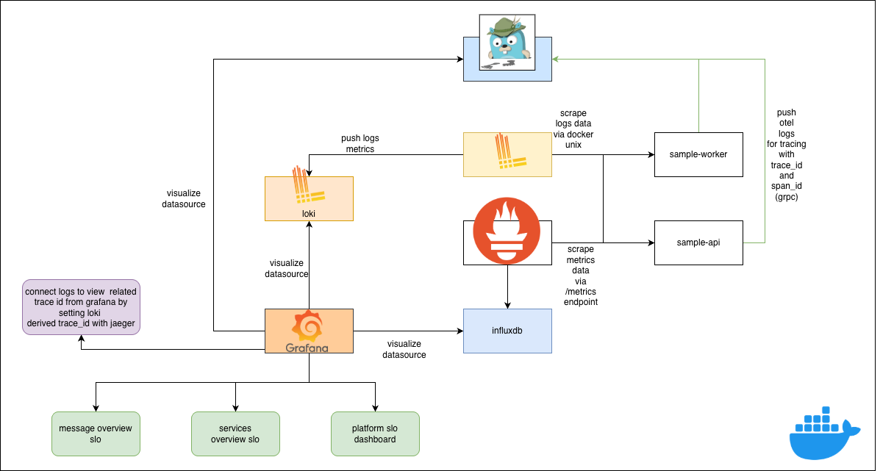

**Access services:**

| Service    | URL                          | Credentials |
|------------|------------------------------|-------------|
| Prometheus     | http://localhost:9090      | N/A |
| Grafana        | http://localhost:3000      | admin/admin |
| Jaeger UI      | http://localhost:16686     | N/A |
| Loki API        | http://localhost:3100      | N/A |
| sampleapi       | http://localhost:8080      | N/A |
| sampleworker   | N/A                        | N/A |
| sampleworker_2 (for fail scenarios) | N/A   | N/A |

Explanation:

- **Prometheus**: Metrics collection and storage system that scrapes metrics from services and stores time-series data
- **Grafana**: Visualization platform that queries Prometheus and Loki to display dashboards, graphs, and alerts
- **Jaeger UI**: Distributed tracing UI for viewing request flows across services and analyzing performance bottlenecks
- **Loki**: Log aggregation system that collects and stores logs from all services, queryable via LogQL
- **sampleapi**: HTTP API service that exposes REST endpoints (`/healthz`), publishes messages to SQS, and exposes Prometheus metrics
- **sampleworker**: Background worker service that consumes messages from SQS, processes tasks asynchronously, and includes distributed tracing
  - This will be simulated with email sent in 5s interval
- **sampleworker_2**: Can be acting as a replica of sampleworker but with email failure injection enabled to simulate errors and observe SLO violation metrics


#### Step 2: Access Grafana

1. Open Grafana in your browser: `http://localhost:3000`
2. Login with credentials:
   - Username: `admin`
   - Password: `admin`
3. You'll be prompted to change the password on first login (optional for local development)

#### Step 3: View Pre-built Dashboards

Grafana automatically loads the pre-configured dashboards. Navigate to `http://localhost:3000/dashboards`:

**Services Overview Dashboard:**
- Shows real-time health status for all services (sampleapi, sampleworker)
- Displays request rates, error rates, and latency metrics
- Monitor service uptime and response times

**SLO Dashboard:**
- Tracks SLI metrics (latency percentiles: p50, p95, p99)
- Shows error budgets and error rates for email sending from workers
- Displays throughput metrics (requests per second)

#### Step 4: Generate Traffic to View Metrics

Generate some traffic to see metrics populate:

```bash
# Generate requests to sampleapi
for i in {1..10}; do
  curl http://localhost:8080/healthz
  
  sleep 1
done
```

The worker services will process messages from the queue, and you'll see:
- **Metrics** updating in Grafana dashboards
- **Traces** appearing in Jaeger UI (http://localhost:16686)
- **Logs** being collected by Promtail and available in Grafana Explore view

#### Step 5: Explore Metrics in Prometheus

You can also query metrics directly in Prometheus:

1. Access Prometheus UI: http://localhost:9092
2. Try example queries after trying some bash script above:
   ```
   # Request rate
   rate(http_requests_total[5m])
   
   # Error rate
   rate(http_requests_total{status=~"5.."}[5m])
   
   # Latency percentile
   histogram_quantile(0.95, rate(http_request_duration_seconds_bucket[5m]))
   ```

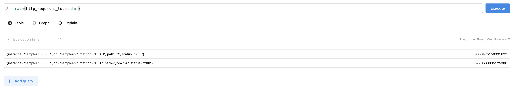

#### Step 6: View Distributed Traces

1. Access Jaeger UI: http://localhost:16686
2. Select service: `sampleworker` or `sampleapi`
3. Click **Find Traces** to see trace spans
4. Click on a trace to view the complete request flow with timing

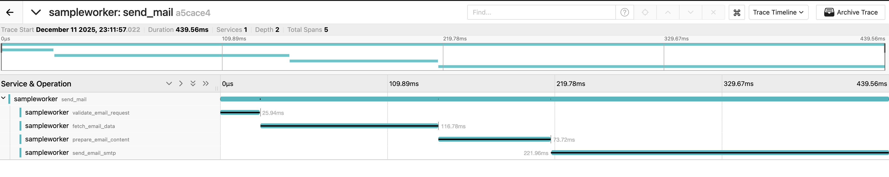

#### Step 7: Correlate Logs with Traces

Open this link:
```
http://localhost:3000/explore?schemaVersion=1&panes=%7B%2269v%22:%7B%22datasource%22:%22loki%22,%22queries%22:%5B%7B%22refId%22:%22A%22,%22expr%22:%22%7Bjob%3D%5C%22sampleworker%5C%22%7D%20%7C%3D%20%60%60%22,%22queryType%22:%22range%22,%22datasource%22:%7B%22type%22:%22loki%22,%22uid%22:%22loki%22%7D,%22editorMode%22:%22builder%22%7D%5D,%22range%22:%7B%22from%22:%22now-1h%22,%22to%22:%22now%22%7D%7D%7D&orgId=1
```

Or manually open with Grafana:
1. Go to **Explore** → Select **Loki** datasource
3. Query logs by from sampleworker:
   ```logql
   {job=~"sampleworker"} |= ``
   ```
4. View logs correlated with the specific trace to understand the complete request flow


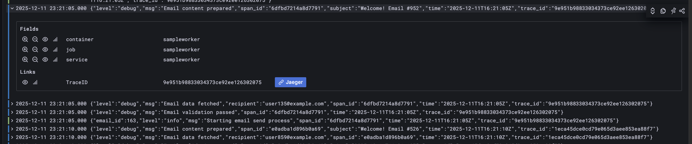

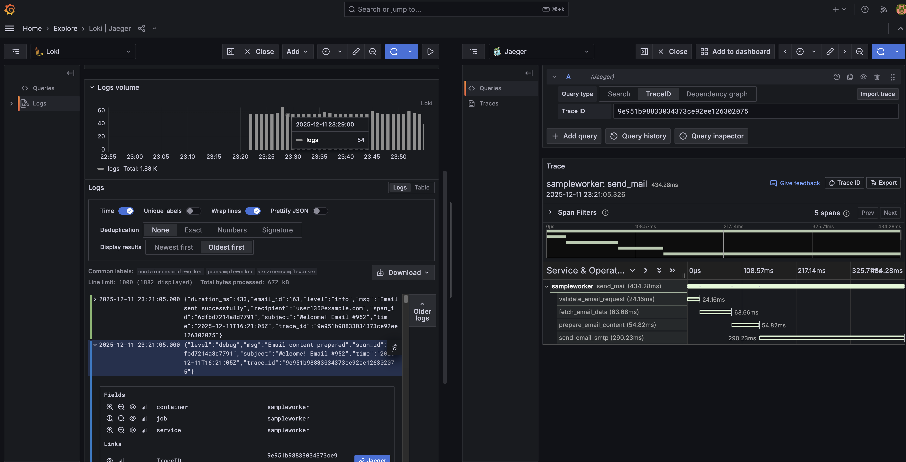


#### Step 8: Simulate SLO violation by sending email unsucessfully

- In `docker-compose.local.yaml`

- Allow `sampleworker-fail-simulate` to start up by uncommenting below code, note that `FAIL_SIMULATE_ENABLED` is enabled and this worker will always send failed email

```
sampleworker-fail-simulate:
...
  environment:
    - FAIL_SIMULATE_ENABLED=true
    ..
...
```

- Start `sampleworker-fail-simulate` with `docker-compose -f docker-compose.local.yml up -d`

- Access to grafana with:
  - SLO-Dashboard: http://localhost:3000/d/slo-dashboard/slo-dashboard?orgId=1&from=2025-12-11T14:23:04.650Z&to=2025-12-11T17:23:04.650Z&timezone=browser&refresh=5s&viewPanel=panel-17
  - **Explore** with **loki** datasource to view failed logs with trace

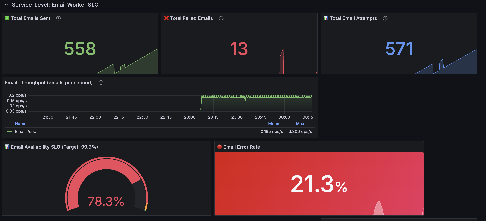

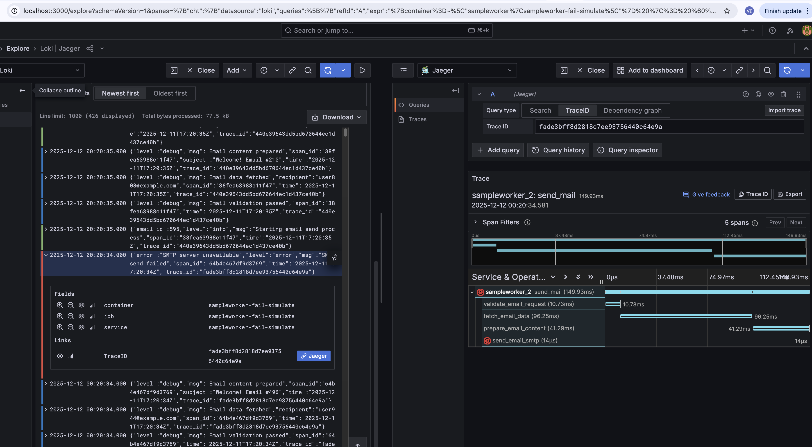

### SLO Explanation

#### Message-Level vs Service-Level Metrics

**Service-Level Metrics** (see `monitoring/grafana/dashboards/slo-dashboard.json` sections: "Service-Level: API Service SLO" and "Service-Level: Email Worker SLO"):
- Aggregated metrics across all operations (e.g., `sum(worker_emails_sent_total)`, overall availability %, error budget)
- Relating application runtime, the resources usage metrics like memory usages, or go configuration like go routine, garbage collection timing
- Uptime for each service running by calculating how much `http_requests_total`
- Focus: "Is the service healthy?" - monitors SLO compliance and overall service health

**Message-Level Metrics** (see `monitoring/grafana/dashboards/slo-dashboard.json` section: "Message-Level: Individual Email Processing Tracking"):
- Per-message performance metrics (e.g., `histogram_quantile(0.95, sum(rate(worker_email_duration_seconds_bucket{job=~\"sampleworker.*\"}[5m])) by (le))` for email duration p50/p95/p99) 
- Focus: "Why is it slow?" - helps debug individual message processing performance

**Platform Level** metrics (skip from now since most metrics will collect from real AWS cloud environment)
  - For the idea, these Platform metris can gather all of necessary resources from AWS like:
    - ECS Cluster basic metrics with cpu utilization, memory utilization usage for each service running on clusters
    - ALB: Application load balancer with 5xx errors in the platform
    - SQS messages number
    - etc
